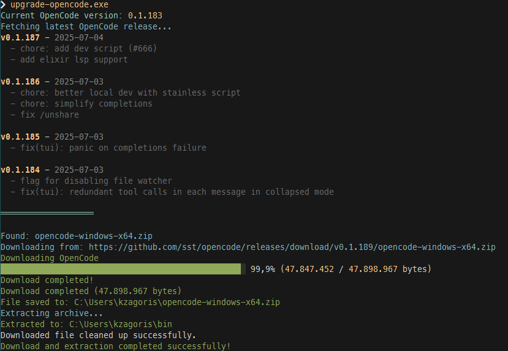

# OpenCode Updater

This is a .NET 9.0 aot console application that downloads and installs the latest [OpenCode release from GitHub](https://github.com/sst/opencode). The app fetches recent changelogs, downloads the latest version with a progress bar, extracts the archive to a user-defined directory, and confirms the successful completion of the upgrade.



## Core Functionality

- Checks the current installed OpenCode version (if available)
- Fetches the latest release from the sst/opencode GitHub repository
- Compares versions and skips download if already up to date
- **Displays release notes** for all versions between the current and the latest when an update is available
- Downloads the appropriate platform version (Windows, macOS, Linux)
- Extract it to the appropriate directory
- Cleans up temporary files

## Getting Started

### Installation

You can obtain it from the releases, or alternatively, you can build it yourself.

### Prerequisites

- .NET 9.0 SDK

### Build Commands

```bash
# Build the project
dotnet build

# Build for release
dotnet build --configuration Release

# Publish as AOT (Ahead-of-Time compiled)
dotnet publish --configuration Release
```

### Run Commands

```bash
# Run the application
dotnet run

# Run with arguments
dotnet run -- [arguments]
```

## Code Style

- **Imports**: `using` statements sorted alphabetically, system namespaces first
- **Formatting**: 4-space indentation, no tabs, 120-char line length, use `dotnet format`
- **Types**: Prefer explicit types; use `var` only when type is obvious
- **Naming**: PascalCase for classes/methods/properties, camelCase for locals/parameters, constants in PascalCase
- **File names**: Match public type names
- **Error handling**: Use try/catch with specific exceptions; log and rethrow or exit non-zero
- **Nullability**: Nullable reference types enabled; avoid `!` unless necessary
- **Async**: Use async/await, suffix async methods with `Async`

## Architecture & Design

### Application Structure

- **Modular design**: Code is organized into separate services, models, and helpers
- **Dependency injection**: Services are injected through constructor parameters
- **Separation of concerns**: Each class has a single responsibility
- **Top-level program**: Uses C# 9+ top-level statements in minimal `Program.cs`
- **AOT compilation**: Configured for Ahead-of-Time compilation with trimming for smaller executables

### Project Structure

```
├── Program.cs                    # Entry point with dependency setup
├── OpenCodeUpdater.cs           # Main orchestrator class
├── Services/                    # Business logic services
│   ├── OpenCodeVersionService.cs    # Version checking and comparison
│   ├── GitHubApiService.cs          # GitHub API interactions
│   ├── ReleaseNotesService.cs       # Release notes fetching and filtering
│   ├── FileDownloadService.cs       # File downloads with progress
│   ├── ArchiveExtractionService.cs  # ZIP extraction and cleanup
│   ├── PlatformDetectionService.cs  # Platform detection
│   ├── IConsoleOutputService.cs     # Console output interface
│   ├── SpectreConsoleOutputService.cs # Rich console output with Spectre.Console
│   └── BasicConsoleOutputService.cs # Fallback console output
├── Models/                      # Data models
│   ├── OpenCodeRelease.cs           # GitHub release representation
│   ├── ReleaseNote.cs               # Individual release information
│   ├── SemanticVersion.cs           # Semantic version handling
│   └── InstallationResult.cs        # Installation outcome
├── Helpers/                     # Utility classes
│   ├── ValidationHelpers.cs         # URL and file validation
│   └── PathHelpers.cs               # Safe path operations
└── Errors/                      # Error handling
    └── ErrorTypes.cs                # OneOf error types
```

### Key Technologies

- **HTTP client**: Uses `HttpClient` to interact with GitHub API
- **JSON parsing**: Uses `System.Text.Json` for parsing GitHub API responses
- **Console UI**: Uses `Spectre.Console` for rich terminal output with fallback to basic console
- **File operations**: Uses `System.IO.Compression` for ZIP file extraction
- **Process execution**: Uses `System.Diagnostics.Process` to check current OpenCode version
- **Source generators**: Uses regex source generators for efficient version parsing
- **Error handling**: Uses `OneOf` library for functional error handling
- **Dependency management**: Manual dependency injection for simplicity

## External Libraries

This project uses several external libraries. Here are links to their official documentation:

### Core Dependencies

#### OneOf (Functional Error Handling)
- **NuGet Package**: `OneOf` v3.0.271
- **Documentation**: https://github.com/mcintyre321/OneOf

#### Spectre.Console (Rich Terminal UI)
- **NuGet Package**: `Spectre.Console` v0.50.0
- **Documentation**: https://spectreconsole.net/

#### System.Text.Json (JSON Serialization)
- **NuGet Package**: `System.Text.Json` v9.0.0
- **Documentation**: https://docs.microsoft.com/en-us/dotnet/standard/serialization/system-text-json/
